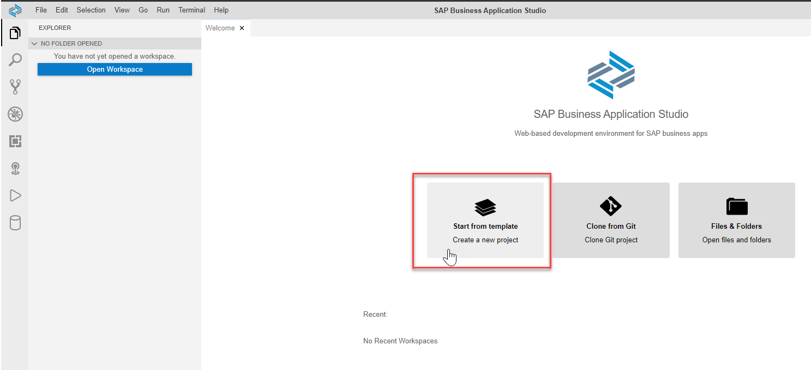
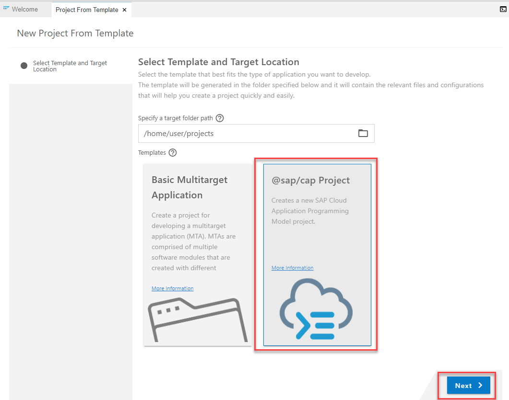
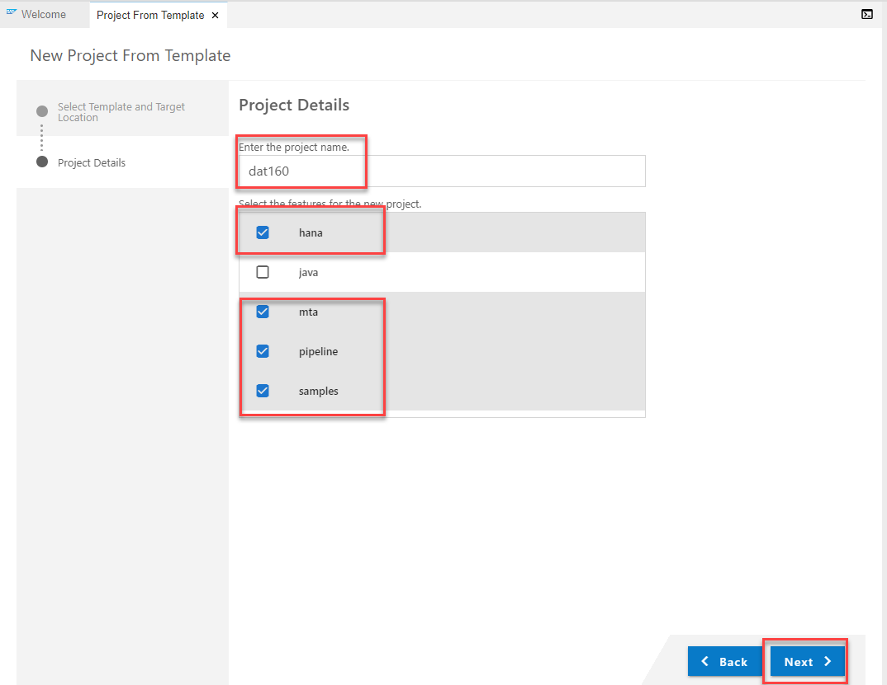
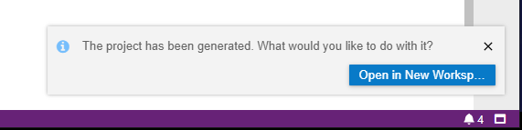
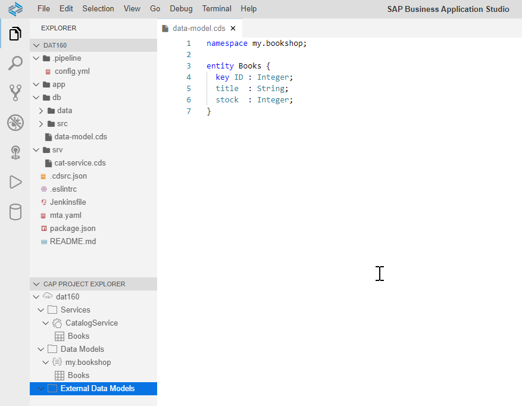
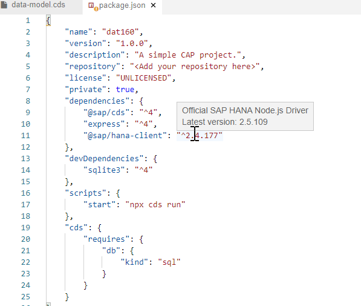

# Exercise 1 - Create CAP Project

In this exercise, we will create...

## Exercise 1.1 Create Project From Template

After completing these steps you will have created...

1. Click **Create project from template** </br>

2. Choose **@sap/cap Project** as the template. Keep the target folder path at the default value. Press **Next**</br>

3. </br>

4. </br>

5. </br>

## Exercise 1.2 Adjust package.json

After completing these steps you will have...

1. </br>

2. cds section of package.json add hana.deploy-format

```JSON
"cds": {
        "hana": {
            "deploy-format": "hdbtable"
        },
        "requires": {
            "db": {
                "kind": "hana"
            }
        }
    }  
```

3. scripts section

```JSON
    "scripts": {
        "hana": "cds deploy --to hana:dat160 --auto-undeploy",
        "start": "cds run",
        "build": "cds build/all --clean"
    },
```


## Summary

You've now ...

Continue to - [Exercise 2 - Exercise 2 Description](../ex2/README.md)

