# Exercise 1 - Create CAP Project

[](./code/)

In this exercise we will create a project from template, adjust it to work with the SAP HANA Cloud and then finally deploy the initial sample content to the SAP HANA Cloud. You can always access the SAP Cloud Platform Trail homepage from this link: [https://account.hanatrial.ondemand.com/](https://account.hanatrial.ondemand.com/)

## Exercise 1.1 Create Project From Template

[Video Link](https://youtu.be/LpN8h19CxoQ)</br>
After completing these steps you will have created basic CAP project which contains sample data and service definitions.

1. Click **Create project from template** </br>

2. Choose **@sap/cap Project** as the template. Keep the target folder path at the default value. Press **Next**</br>

3. Input **dat160** as your project name.  Check the feature boxes to add **hana**, **mta**, **pipeline** and **samples** to the project.  </br></br>The **hana** option adds configuration for SAP HANA deployment. The **mta** feature adds an mta.yaml file out of CDS models and config.  The **pipeline** option adds files for CI/CD pipeline integration. Finally using **samples** will add simple bookshop sample data model and service definitions to your project.  </br></br>Press **Next** to continue.</br>

4. Upon completion your project will be generated. You should see a small dialog box in the bottom, right of the screen. Press the **Open in New Worksp...** button to open the new project in your editor</br>

5. If you want you can swtich between the graphical and the source code based editor with the **Open With** context menu.</br>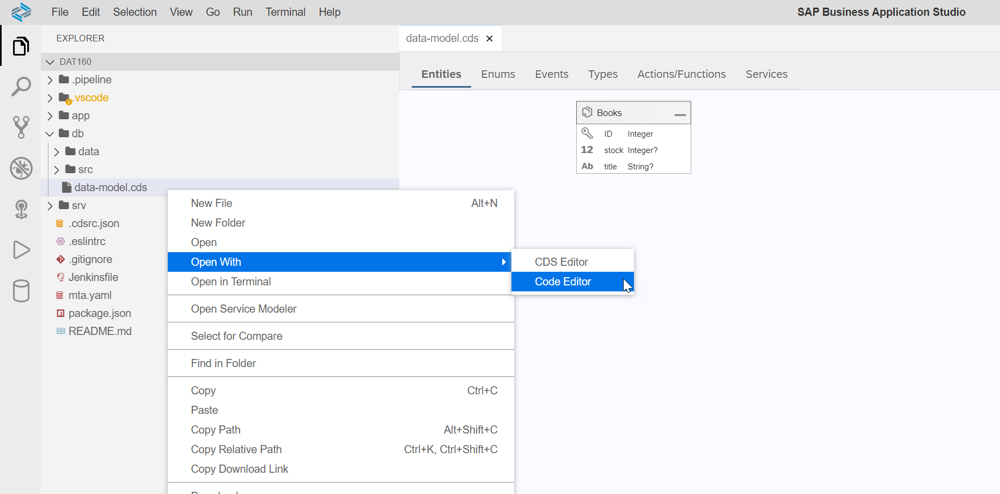
   
6. The editor will reload and the generated project structure and sample content should be accessible. For example open the /db/data-model.cds file and you should see the definition for the **Books** entity.</br>

## Exercise 1.2 Adjust package.json

[Video Link](https://youtu.be/jFdBG-mHyHM)</br>
After completing these steps you will have made the necessary changes and additions to the package.json into order to support deployment to SAP HANA Cloud.

1. Open the package.json in the root of your project. If you mouse over the version number of the dependencies you will see the most recent version available.  Please make sure that the @sap/hana-client version is using 2.5.x or higher. </br>

2. In the cds section of the package.json (toward the bottom of the file) you will find that the wizard generated some content but it's designed for deploying for local testing to SQLite. We want to change the content to support SAP HANA Cloud. The complete content of this section should match the following code:

```json
    "cds": {
        "preview": {
            "ui5": {
                "version": "1.80.2"
            }
        },
        "hana": {
            "deploy-format": "hdbtable"
        },
        "requires": {
            "db": {
                "kind": "hana"
            }
        }
    }
```

3. Although not required, we can add certain scripts to the package.json as well. These can be used to help automate certain commands or even just provide shortcuts to the cds command line tool.  Please update the scripts section to have the following three entries (replacing the one that is already in the file)

```json
    "scripts": {
        "hana": "cds deploy --to hana:dat160 --auto-undeploy",
        "start": "cds run",
        "build": "cds build/all --clean"
    },
```

4. At this point your complete package.json should look similar to this (note your version numbers on the dependencies might actually be newer than what is shown here - that is perfectly fine).</br>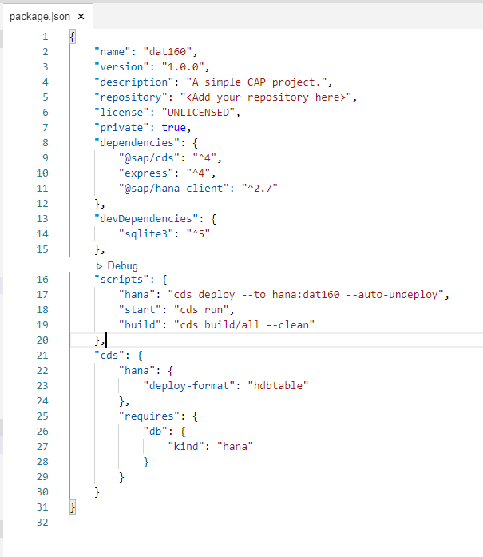

5. You will find that many actions we perform in the Business Application Studio are done via the terminal directly.  At any point you can open a cloud terminal using **Terminal -> New terminal**. Please do so now.</br>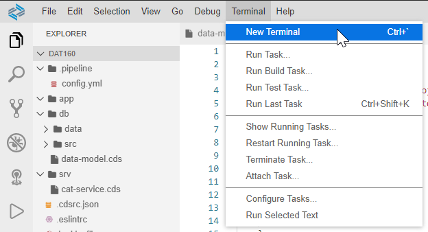

6. From this terminal issue the command ```npm install```.  This will read the dependencies from your package.json and download all the specified modules into your project from the internet. </br>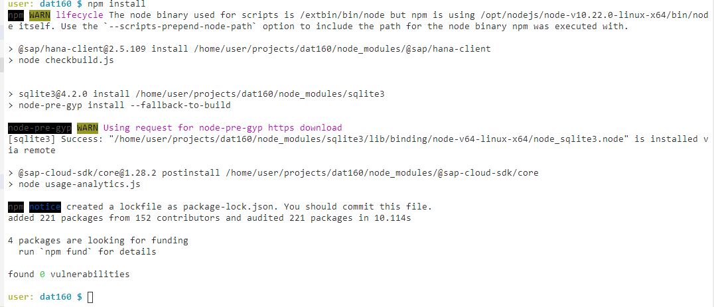

## Exercise 1.3 Build Sample Project Into HANA

[Video Link](https://youtu.be/31bdCX0t1aY)</br>
After completing these steps you will have built the sample project contents and deployed them into the SAP HANA Cloud database.

1. From the same terminal window, issue the following command ```npm run build```.  This will kick off one the scripts we defined in the package.json. This particular script will issue the cds build which in turn will compile the data definitions of your project into HANA specific development artifacts.

2. You should see output from the command similar to this screenshot. The list of artifacts should include hdbview, hdbtable, and hdbtabledata artifacts.</br>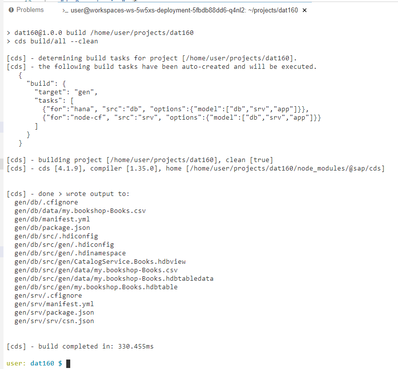

3. All of this content was placed into a separate **/gen** folder in your project. This keeps the sources separate from the deployable/executable portions of your project.  You can see this addition to the project structure in the main project navigation area.</br>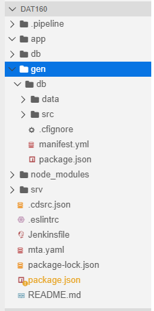

4. Now we want to send this content into the SAP HANA Cloud database.  For this we will use another script from our package.json. Execute this command in the terminal: ```npm run hana```. This command will use the cds command line tool (cli) to create an HDI container (named dat160) and then deploy all of the content from **/gen/db** into that HDI container.

5. There will be a large log written out from this command. However the ending of the log should look something like this screenshot and it should reach the state **Done** without displaying an error.</br>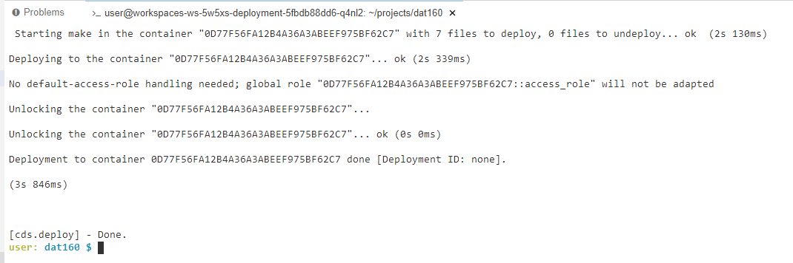

6. Now we want to verify the content has been created and view it in the SAP HANA Cloud database.  We also have a sample code project that helps with HANA interaction from the terminal.  We can install that tool into our SAP Business Application Studio Dev Space this command from the terminal: ```npm install -g hana-cli```</br>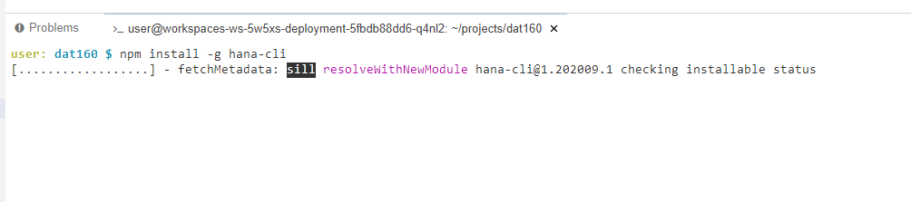</br>Unlike the npm install we issued earlier, here we use the -g parameter. This installs the specified module globally instead of only for use in this particular project.

7. The hana-cli tool we just installed uses a file named default-env.json to read the connection parameters and credentials for working with the SAP HANA Cloud. This file is also used by many other SAP modules, libraries and concepts. In fact the cds deploy command we issued previously actually created this default-env.json file for us already and stored all the connection details for our SAP HANA Cloud trial system in it. We can use this file to connect to the HANA DB where we've already deployed our CAP project content. For instance you can use the command ```hana-cli systemInfo``` </br>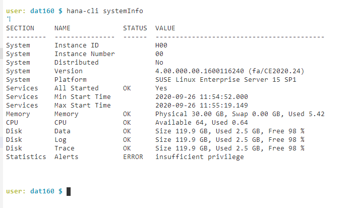

8. The default-env.json file also contains connection information to the specific HDI container that was created for the CAP project. If you issue the command ```hana-cli tables``` you should see the **MY_BOOKSHOP_BOOKS** table generated from the sample entity.</br>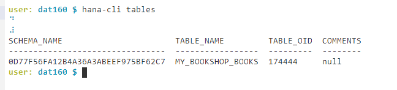

9. For more extensive work with the SAP HANA Cloud database and the HDI container we want to use the Database Explorer. Issue the command ```hana-cli opendbx``` and get the URL for the Database Explorer connected to your SAP HANA Cloud trial instance. You can also return to the SAP Cloud Cockpit where we earlier check if your SAP HANA Cloud instance was running. From that same tile there is also a button to launch the Database Explorer.</br>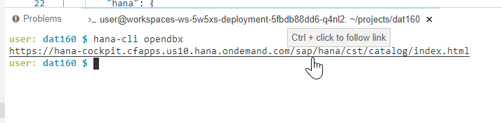

10. When the Database Explorer initially opens, the content is likely empty (unless you have done some work for another workshop or tutorial).  Press the **+** icon to create a new database connection.</br>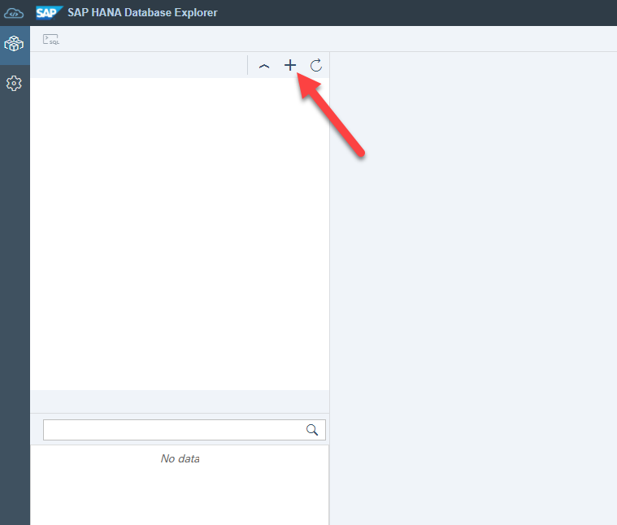

11. In the **Add Database** dialog, choose **Database Type** of HDI Container.  Then you should see a list of possible containers.  Yours should be named **dat160** and is likely the only entry listed in the results. Press **OK** to continue after selecting the **dat160** entry.</br>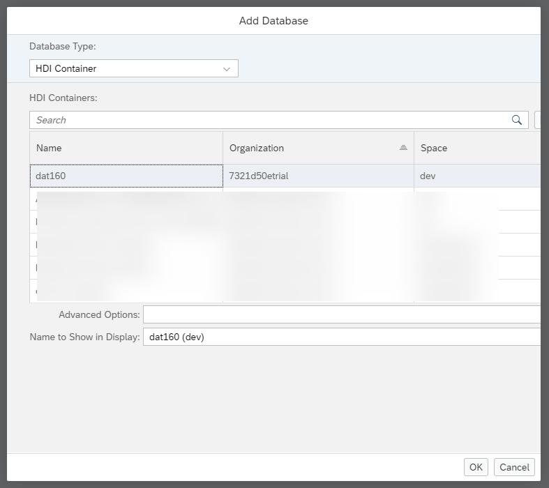

12. If you choose the Tables option in the navigation tree you should find one sample table named **MY_BOOKSHOP_BOOKS**. Right mouse click on this entry and choose **Open Data**</br>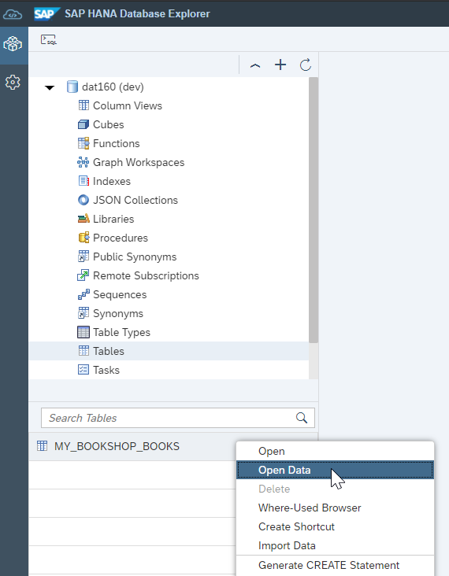

13. The data preview will open and there should be two records which were loaded via CSV file which was part of the sample project content.</br>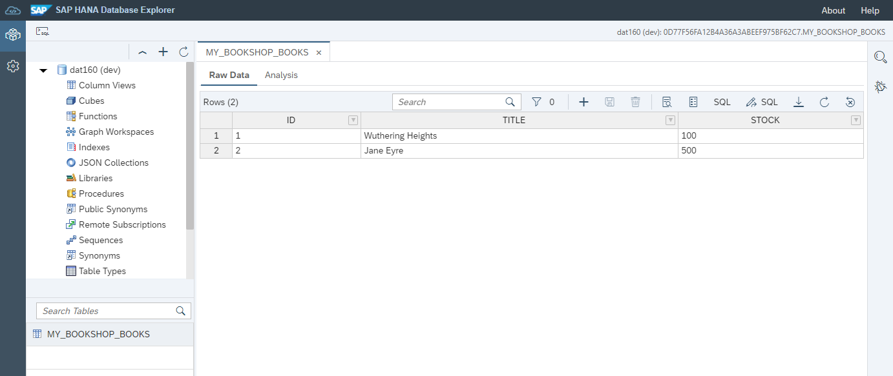

## Summary

You've now created your CAP Project and deployed sample content into the SAP HANA Cloud database. You verified everything was created correctly in the Database Explorer. You probably want to keep the Database Explorer tab open as we will return here to verify subsequent exercises as well. However you can now return to the Business Application Studio tab/window in your browser and continue with Exercise 2.

Continue to - [Exercise 2 - Building the Data Model](../ex2/README.md)
