# Exercise 4 - User Interface

[](./code/)

In this exercise, we will create UI annotations and generate a Fiori Elements application.

## Exercise 4.1 Add Fiori Annotations

[Video Link](https://youtu.be/_vJdu03A9UM)</br>
After completing these steps you will have added Fiori annotations to our CAP application.

1. Create a new file **/srv/po-header-fiori.cds**.  Add the following annotation definition to this file. This will add Fiori-specific List and Object annotations. This tells Fiori in a descriptive way which fields from our service should appear in the user interface and how they should act.  All this is done without getting into UI technology specifics. 

```cds
using CatalogService as pos from './cat-service';
using CatalogService.POItems from './po-item-fiori';

annotate pos.POHeaders with @( // header-level annotations
    // ---------------------------------------------------------------------------
    // List Report
    // ---------------------------------------------------------------------------
    // POs List
    UI        : {
        LineItem            : [
        {
            $Type             : 'UI.DataField',
            Value             : ID,
            ![@UI.Importance] : #High
        },
        {
            $Type             : 'UI.DataField',
            Value             : grossAmount,
            ![@UI.Importance] : #High
        },
        {
            $Type             : 'UI.DataField',
            Value             : currency_code,
            ![@UI.Importance] : #Medium
        },
        {
            $Type : 'UI.DataField',
            Value : currency.symbol
        },
        ],
        PresentationVariant : {SortOrder : [
        {
            $Type      : 'Common.SortOrderType',
            Property   : ID,
            Descending : false
        },
        {
            $Type      : 'Common.SortOrderType',
            Property   : partner,
            Descending : false
        }
        ]}
    },

    // ---------------------------------------------------------------------------
    // Object Page
    // ---------------------------------------------------------------------------
    // Page Header
    UI        : {
        HeaderInfo                     : {
            TypeName       : '{i18n>poService}',
            TypeNamePlural : '{i18n>poServices}',
            Title          : {Value : ID},
        },
        HeaderFacets                   : [
        {
            $Type             : 'UI.ReferenceFacet',
            Target            : '@UI.FieldGroup#Description',
            ![@UI.Importance] : #Medium
        },
        {
            $Type             : 'UI.ReferenceFacet',
            Target            : '@UI.FieldGroup#AdministrativeData',
            ![@UI.Importance] : #Medium
        }
        ],
        FieldGroup #Description        : {Data : [
        {
            $Type : 'UI.DataField',
            Value : ID
        }
        ]},
        FieldGroup #Details            : {Data : [
        {
            $Type : 'UI.DataField',
            Value : partner
        },
        {
            $Type             : 'UI.DataField',
            Value             : noteId,
            ![@UI.Importance] : #Medium
        },
        {
            $Type : 'UI.DataField',
            Value : grossAmount
        },
        {
            $Type : 'UI.DataField',
            Value : netAmount
        },
        {
            $Type : 'UI.DataField',
            Value : taxAmount
        },
        {
            $Type : 'UI.DataField',
            Value : currency_code
        },
        {
            $Type                   : 'UI.DataField',
            Value                   : currency.symbol,
            ![@Common.FieldControl] : #ReadOnly
        },
        {
            $Type                   : 'UI.DataField',
            Value                   : currency.name,
            ![@Common.FieldControl] : #ReadOnly
        },
        ]},
        FieldGroup #AdministrativeData : {Data : [
        {
            $Type : 'UI.DataField',
            Value : createdBy
        },
        {
            $Type : 'UI.DataField',
            Value : createdAt
        },
        {
            $Type : 'UI.DataField',
            Value : modifiedBy
        },
        {
            $Type : 'UI.DataField',
            Value : modifiedAt
        }
        ]}
    },
    // Page Facets
    UI.Facets : [
    {
        $Type  : 'UI.CollectionFacet',
        ID     : 'PODetails',
        Label  : '{i18n>details}',
        Facets : [{
            $Type  : 'UI.ReferenceFacet',
            Label  : '{i18n>details}',
            Target : '@UI.FieldGroup#Details'
        }]
    },
    {
        $Type  : 'UI.ReferenceFacet',
        Label  : '{i18n>po_items}',
        Target : 'item/@UI.LineItem'
    }
    ]
);
```

2. SAP Fiori elements apps are generic frontends, which construct and render the pages and controls based on annotated metadata documents. The annotations provide semantic annotations used to render such content. We also see that we can use **FieldControl** which will set the state of input fields based upon these columns – for example Read Only or Mandatory.

3. For more information on the annotations support in Cloud Application Programming Model, please refer to [the documentation](https://cap.cloud.sap/docs/advanced/odata#annotations).

4. Now we will repeat the process for the Purchase Order Items. Create a file **/srv/po-item-fiori.cds** and use the following content in this file.

```cds
using CatalogService as pos from './cat-service';


annotate pos.POItems with @( // header-level annotations
    // ---------------------------------------------------------------------------
    // List Report
    // ---------------------------------------------------------------------------
    // PO Items List
    UI        : {
        LineItem            : [
        {
            $Type             : 'UI.DataField',
            Value             : product,
            ![@UI.Importance] : #High
        },
        {
            $Type             : 'UI.DataField',
            Value             : deliveryDate,
            ![@UI.Importance] : #High
        },
        {
            $Type             : 'UI.DataField',
            Value             : quantity,
            ![@UI.Importance] : #High
        },
        {
            $Type             : 'UI.DataField',
            Value             : quantityUnit,
            ![@UI.Importance] : #High
        }
        ],
        PresentationVariant : {SortOrder : [{
            $Type      : 'Common.SortOrderType',
            Property   : product,
            Descending : false
        }]}
    },
    // ---------------------------------------------------------------------------
    // Object Page
    // ---------------------------------------------------------------------------
    // Page Header
    UI        : {
        HeaderInfo              : {
            TypeName       : '{i18n>poService}',
            TypeNamePlural : '{i18n>poServices}',
            Title          : {Value : ID},
        },
        HeaderFacets            : [{
            $Type             : 'UI.ReferenceFacet',
            Target            : '@UI.FieldGroup#Description',
            ![@UI.Importance] : #Medium
        }],
        FieldGroup #Description : {Data : [
        {
            $Type : 'UI.DataField',
            Value : ID
        },
        {
            $Type : 'UI.DataField',
            Value : product
        }
        ]},
        FieldGroup #Details     : {Data : [
        {
            $Type : 'UI.DataField',
            Value : product
        },
        {
            $Type             : 'UI.DataField',
            Value             : deliveryDate,
            ![@UI.Importance] : #High
        },
        {
            $Type             : 'UI.DataField',
            Value             : quantity,
            ![@UI.Importance] : #High
        },
        {
            $Type             : 'UI.DataField',
            Value             : quantityUnit,
            ![@UI.Importance] : #High
        }
        ]}
    },
    // Page Facets
    UI.Facets : [{
        $Type  : 'UI.CollectionFacet',
        ID     : 'POItemsDetails',
        Label  : '{i18n>details}',
        Facets : [{
            $Type  : 'UI.ReferenceFacet',
            Label  : '{i18n>details}',
            Target : '@UI.FieldGroup#Details'
        }]
    }]
);
```

5. Save, build the project with ```npm run build``` from the Terminal. Run the application again using ```npm start```.

6. From the CAP preview tool, open **Fiori Preview** for Purchase Order Header</br>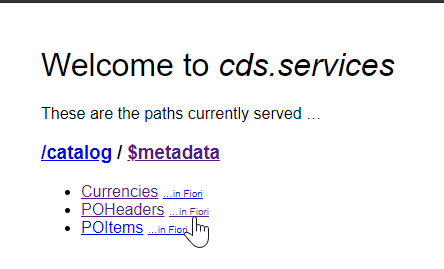

7. This time the UI will work because it's being driven by the Annotations which we just added. Fields we add to the List report section of the annotations automatically appear in the output of this initial page. </br>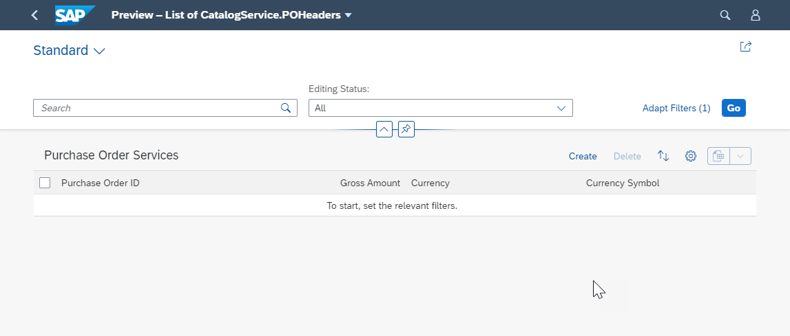

8. We even have Draft support in our application already.</br>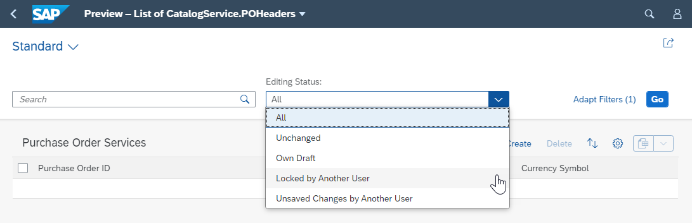

9. Press **Go** to run the query. </br>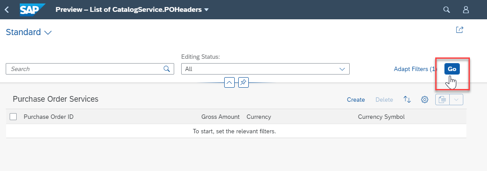 

10. The list view has many features provided by the consistent Fiori 3 design. Notice the Currency Symbol is not in the Purchase Order Header Entity itself. Instead it is data loaded by association to the Currencies entity.  We also see powerful general features like the ability to customize the display (the gear icon) or export to Excel. Finally we also have full Create, Update, Delete support already in the UI. </br>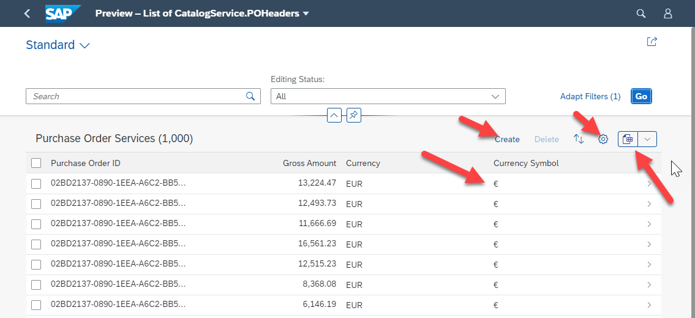 

11. Press the next arrow on a line and you will navigate to the Overview page view, which includes Items as well.</br>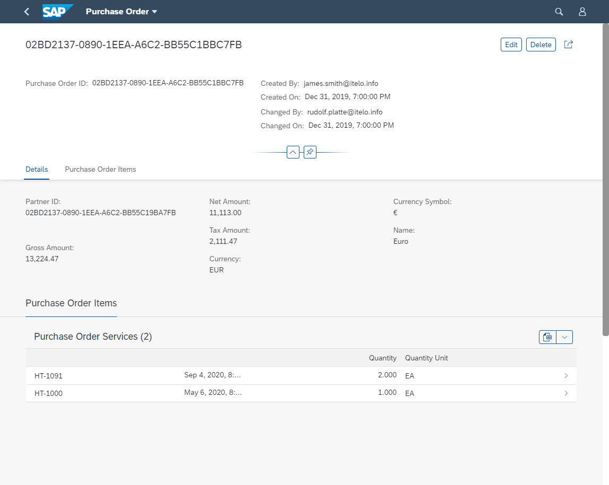

12. Press **Edit**.  Change the Net Amount. Press **Save**. </br>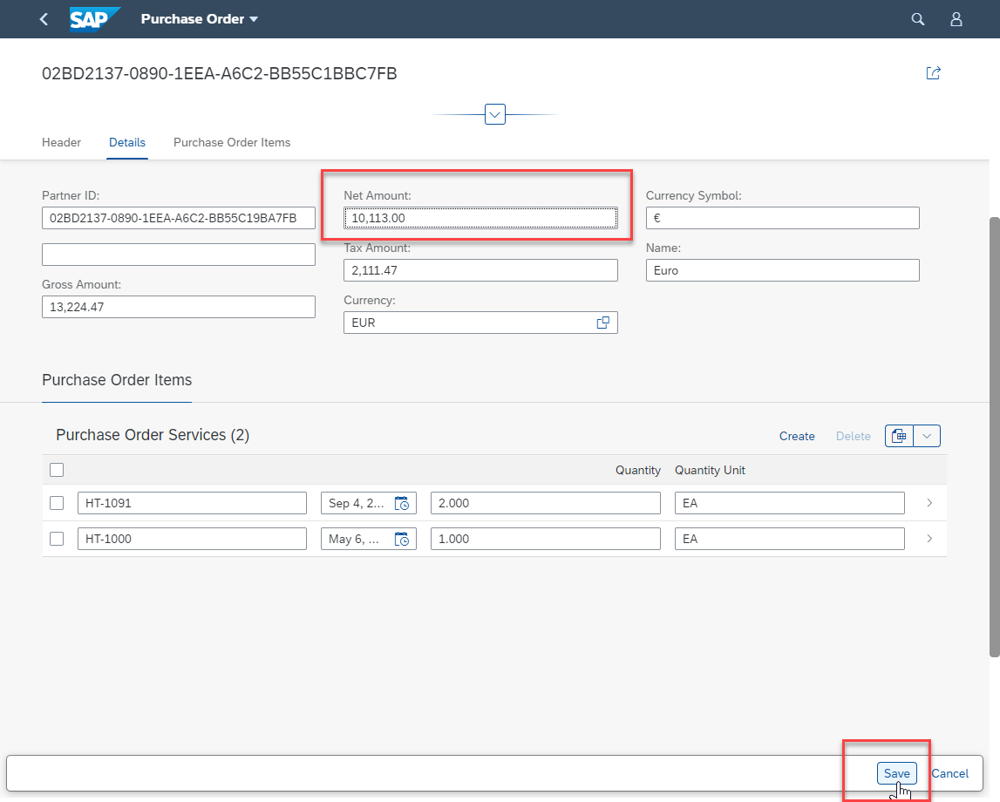

13. Return to console log in the Business Application Studio terminal console display.  You should see the event raised by our exit handler in the previous exercise</br>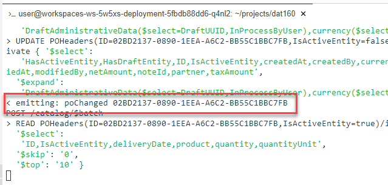

14. But this is just the generic preview generated by CDS for testing. Now let's build our own Fiori Elements Application.

## Exercise 4.2 Setup a Fiori Launchpad Sandbox

[Video Link](https://youtu.be/OgjrgCDhM-Y)</br>
After completing these steps you will have used created a Fiori Launchpad Sandbox inside your CAP application.

1. Create a file: **/app/resources/index.html** with the following code:

```html
<!DOCTYPE html>
<html>
<head>

	<meta http-equiv="X-UA-Compatible" content="IE=edge" />
	<meta http-equiv="Content-Type" content="text/html;charset=UTF-8" />
	<meta name="viewport" content="width=device-width, initial-scale=1.0" />
	<title>TechEd DAT160</title>
	<script>
		window["sap-ushell-config"] = {
			defaultRenderer: "fiori2",			
			applications: {				
				
				"odata-v4": {
					title: "Currencies",
					description: "Currencies in OData V4",
					applicationType : "URL",
					url: "/catalog/Currencies"
				},				
				"odata-v2": {
					title: "Currencies V2",
					description: "Currencies in OData V2",
					applicationType : "URL",
					url: "/v2/catalog/Currencies"
                },
				"po-fiori-preview": {
					title: "POs Preview",
					description: "POs using Fiori Preview",
					applicationType : "URL",
					url: "/$fiori-preview/CatalogService/POHeaders#preview-app"
				}  
			}
		};
	</script>

	<script src="https://sapui5.hana.ondemand.com/test-resources/sap/ushell/bootstrap/sandbox.js"></script>
	<script src="https://sapui5.hana.ondemand.com/resources/sap-ui-core.js"
    	data-sap-ui-libs="sap.m, sap.ushell, sap.collaboration, sap.ui.layout"
    	data-sap-ui-compatVersion="edge"
    	data-sap-ui-theme="sap_fiori_3_dark"
    	data-sap-ui-frameOptions="allow"
	></script>
	<script>
		sap.ui.getCore().attachInit(()=> sap.ushell.Container.createRenderer().placeAt("content"))
	</script>

</head>
<body class="sapUiBody" id="content"></body>
</html>
```

2. This is a Fiori Launchpad Sandbox and we can configure the tiles in the **applications** section of JSON within the file. This is great approach for lightweight testing during CAP development. It lets us see how our UI will look and feel when running in a Launchpad. </br>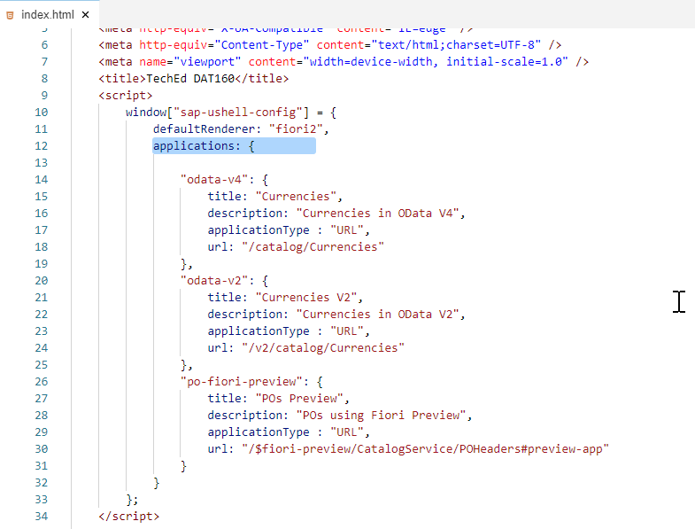

3. Save your changes and run with ```npm start``` from the Terminal again. The preview now as a link to the launchpad. We could have also put our index.html directly in the app folder and then it would have replaced the CDS Preview completely.</br>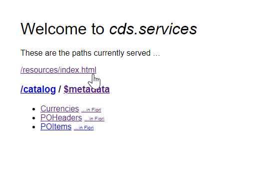

4. See the tiles you configured.  Test them all. They should open your OData services and the Fiori Preview generated by CAP same as the entry preview page. </br>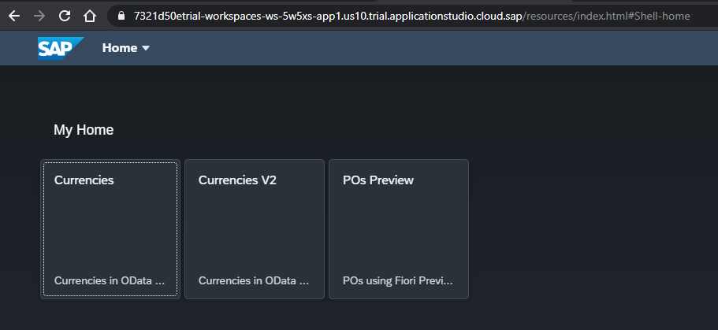

## Exercise 4.3 Generate a Fiori Application

[Video Link](https://youtu.be/PJ9ADjPqMWg)</br>
After completing these steps you will have used the Fiori Tools to generate a full Fiori Elements application.

1. Open the Command Pallet </br>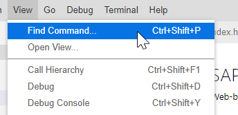

2. Run the **Expore and Install Generator** command.  This is the main tool in the Business Application Studio to provide visual, guided wizards. </br>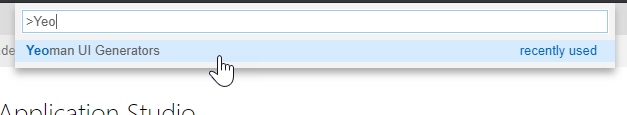

3. Search for **fiori**. Choose the @sap/generator-fiori and press **Install**.</br>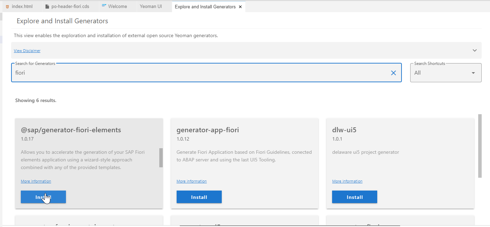

4. After installation is complete, close the **Explore and Install Generators** tab and then run the command **Run Generator** from the Command Pallet to be able to use the newly installed generator. Choose **@sap/fiori:app** from the list of generators.</br>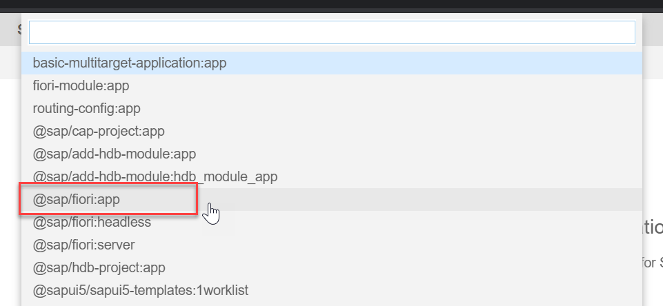

5. Choose **List Report Object Page** and press **Next**. </br>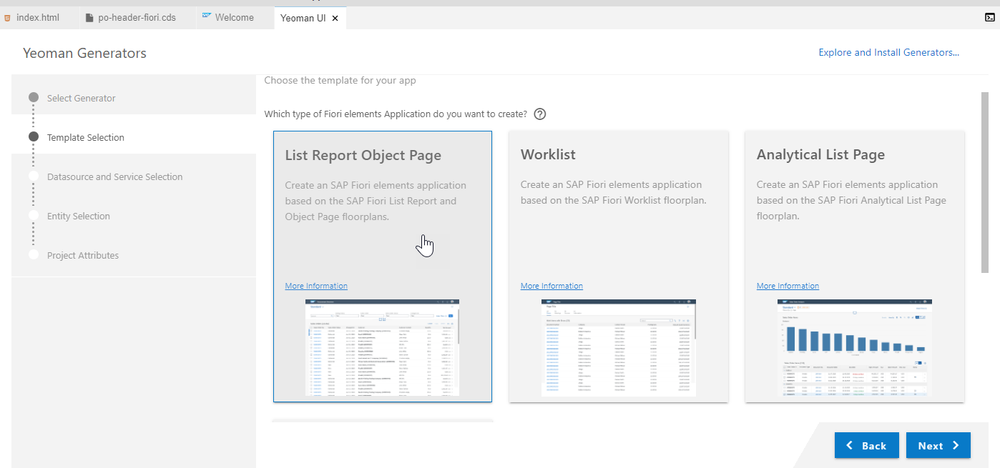

6. Choose **Use a Local CAP Node.js Project** as the Data source.  Then browse and choose the folder path **/home/user/projects/dat160**. Finally select **CatalogService** from the drop down of the OData service.  Press **Next**. </br> 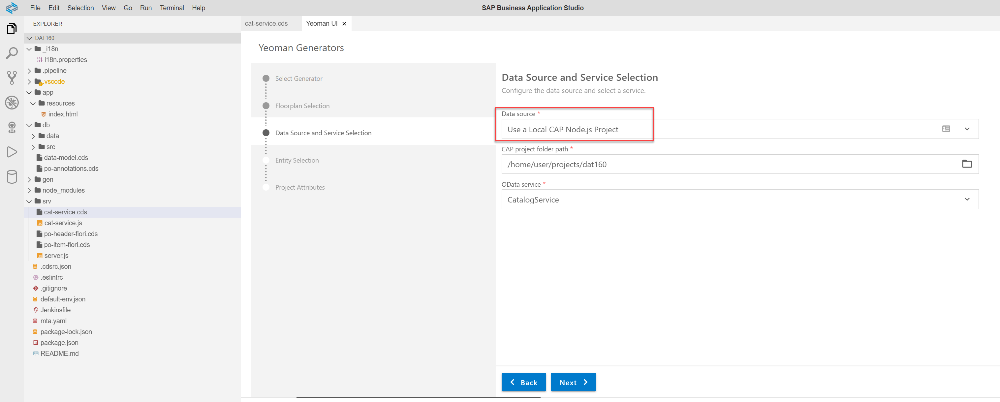

7. Choose **POHeaders** as your Main Entity and **item** as your navigation entity. The wizard is reading the metadata document of your service to propose values and validate your input. Press **Next**. </br>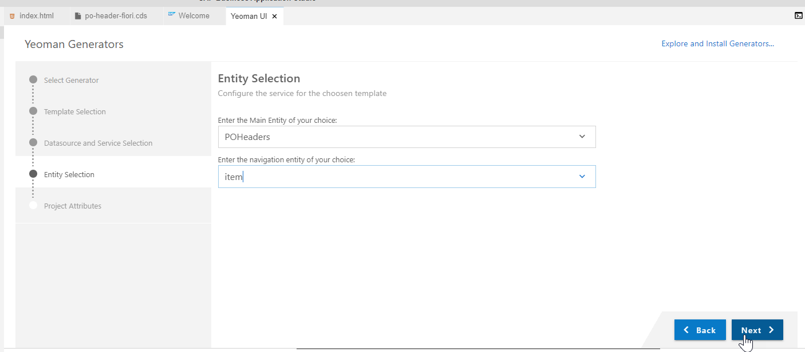

8. Fill in the following values for the Project Attributes and press **Finish**. Please be sure to match the values closely. Otherwise the application the wizard generates will not match to the subsequent steps in this exercise. </br>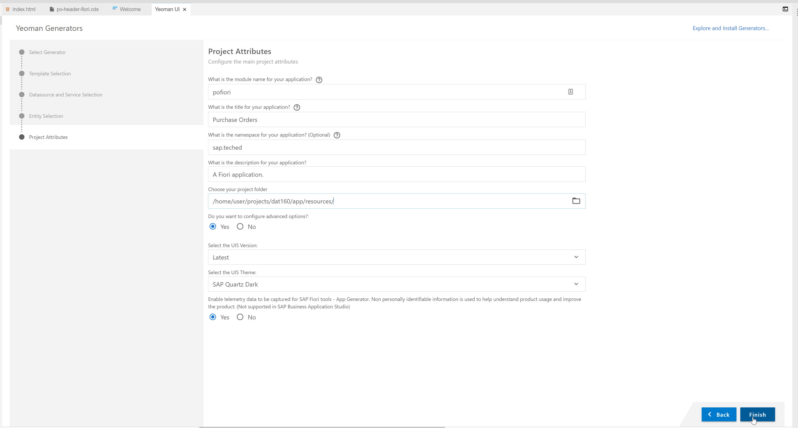 </br> And a zoomed version of this same information:</br>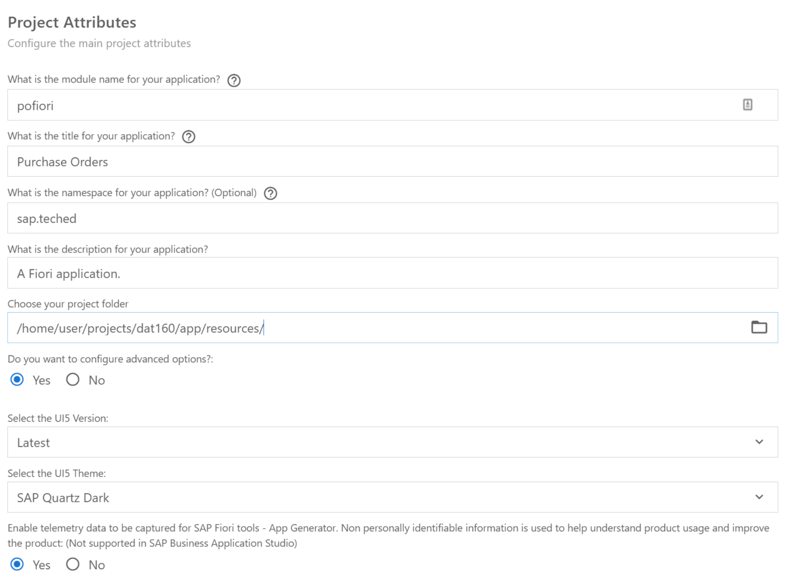

9. You have a fully generated Fiori application in your **/app/** folder. 

10. Return to the **index.html** file in the **/app/resources** folder. Edit the **applications** section to add another tile for this newly generated application. </br>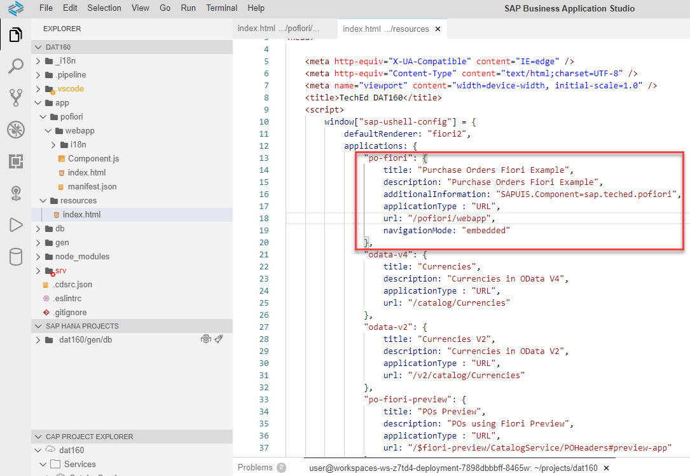

```JavaScript
        "po-fiori": {
					title: "Purchase Orders Fiori Example",
					description: "Purchase Orders Fiori Example",
					additionalInformation: "SAPUI5.Component=sap.teched.pofiori",					
                    applicationType : "URL",
					url: "/pofiori/webapp",
					navigationMode: "embedded"
				},	 
```

11. Save and refresh your Fiori Launchpad Sandbox. You should see the new tile. </br>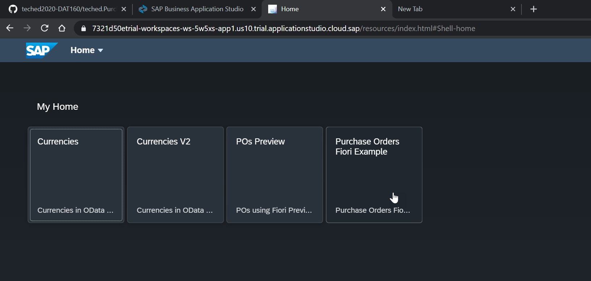

12. Click on it and you can explore your full Fiori Elements application </br>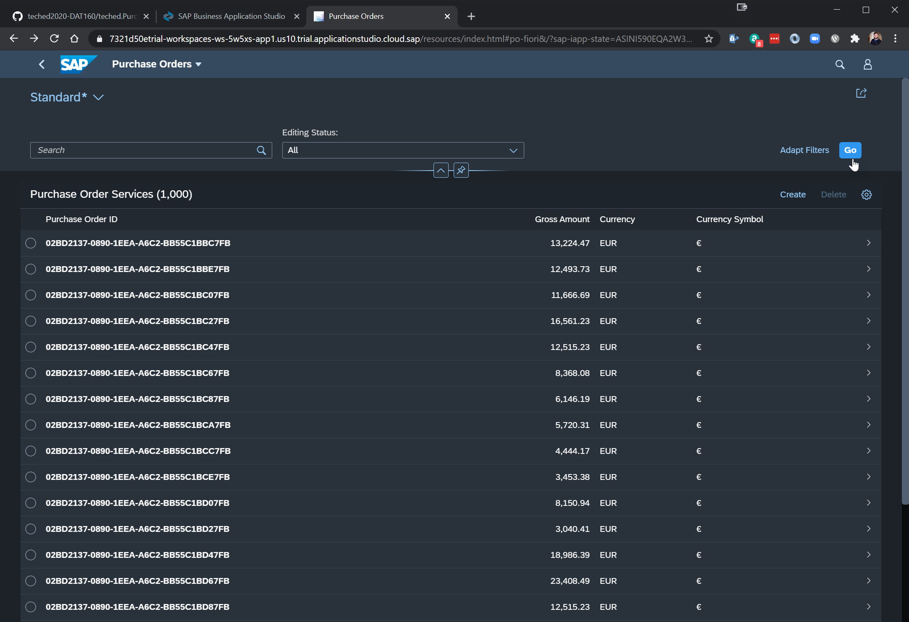

## Summary

You've now built a full stack Cloud Application Programming Model application with database model implemented in SAP HANA Cloud, an OData service implementation and a Fiori Elements user interface.

Continue to - [Exercise 5 - Function Implemented as Stored Procedure](../ex5/README.md)
