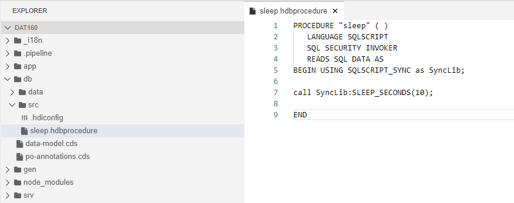
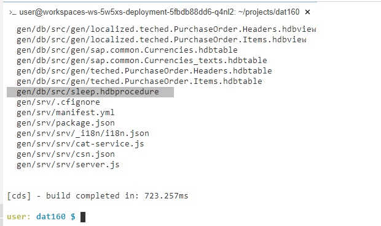
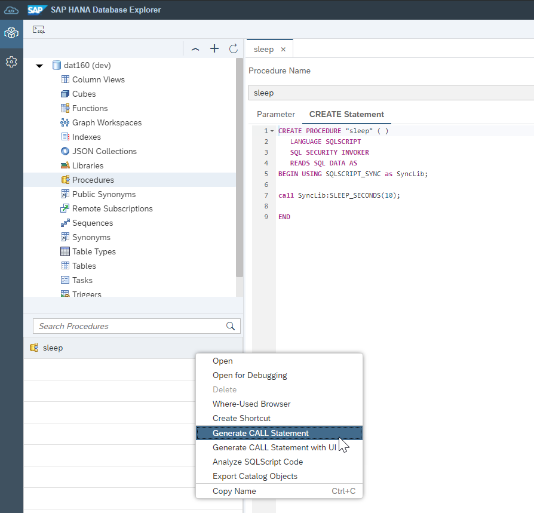
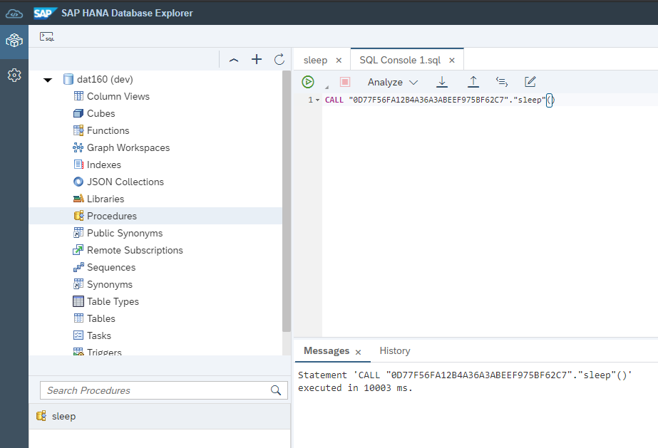
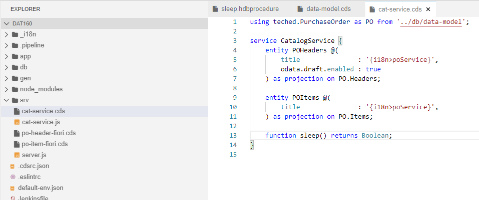
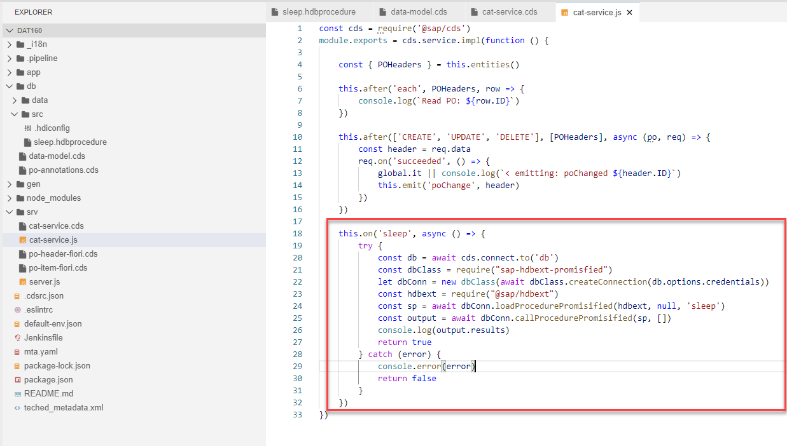
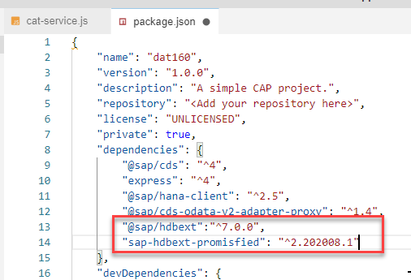
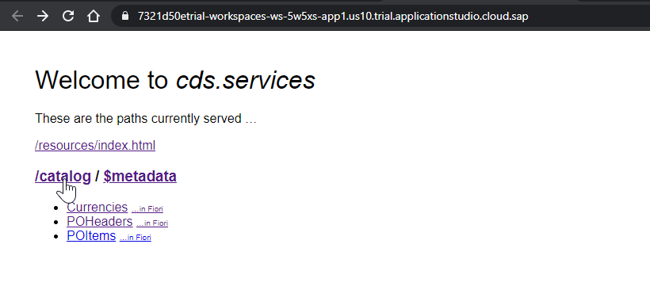
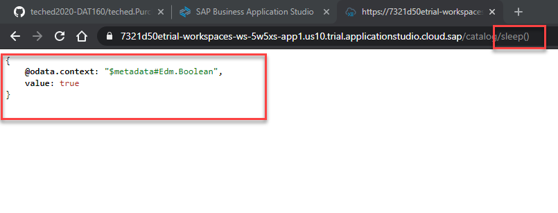

# Exercise 5 - Function Implemented as Stored Procedure

In this exercise, we will create...

## Exercise 5.1 Add Stored Procedure and Use it to Implement a CAP Function

After completing these steps you will have created...

1. In the /db/src folder create a new file named sleep.hdbprocedure </br>

```SQL
PROCEDURE "sleep" ( )
   LANGUAGE SQLSCRIPT
   SQL SECURITY INVOKER
   READS SQL DATA AS
BEGIN USING SQLSCRIPT_SYNC as SyncLib;
 
call SyncLib:SLEEP_SECONDS(10);

END
```

2. Save. Run ```npm run build```  Although this new stored procedure isn't part of CAP, the build will still copy it into the /gen/db folder. </br>

3. Run ```npm run hana```  Likewise the CDS deploy to HANA will also deploy native HANA artifacts as well.</br>

4. If you wish you can return to DB Explorer. Procedure is there now and can be tested. <br></br></br>

5. But now we want to to add this Procedure to the CAP service as a function.  Edit /srv/cat-service.cds. </br>Add: ```function sleep() returns Boolean;```   </br>

6. Just adding the function doesn't do anything.  We need to use the service handler exit in cat-service.js again to implement the call to the Stored Procedure.  </br>

```JavaScript
    this.on('sleep', async () => {
        try {
            const db = await cds.connect.to('db')
            const dbClass = require("sap-hdbext-promisfied")
            let dbConn = new dbClass(await dbClass.createConnection(db.options.credentials))
            const hdbext = require("@sap/hdbext")
            const sp = await dbConn.loadProcedurePromisified(hdbext, null, 'sleep')
            const output = await dbConn.callProcedurePromisified(sp, [])
            console.log(output.results)
            return true
        } catch (error) {
            console.error(error)
            return false
        }
    })
```

7. But we used to additional HANA modules.  We need to add those to our package.json. sap-hdbext-promisfied and @sap/hdbext</br>

8. Save and Run the ```npm install```

9. Run ```npm run build``` then ```npm start```.  The CAP preview UI doesn't list functions or actions, however. Just click on the /catalog for the entire service </br>

10. Manually add **/sleep()** to the end of the URL. If it works correctly it should take 10 seconds to respond since the procedure is running a sleep operation for that long. </br>

## Summary

You've now ...

All Done - Go Home!